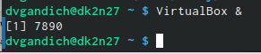
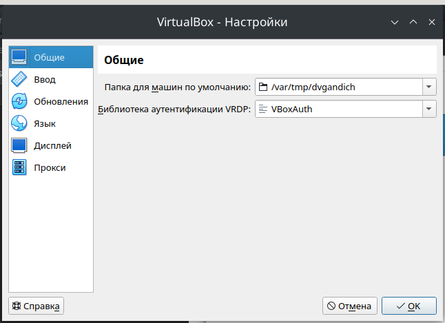
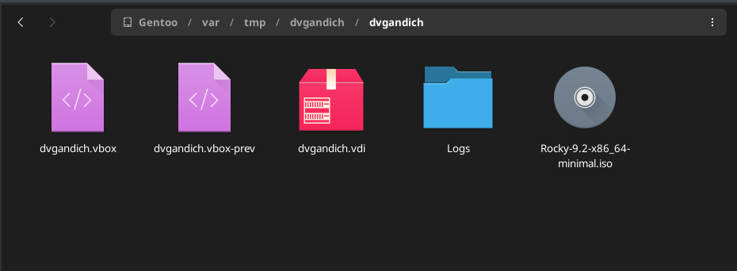
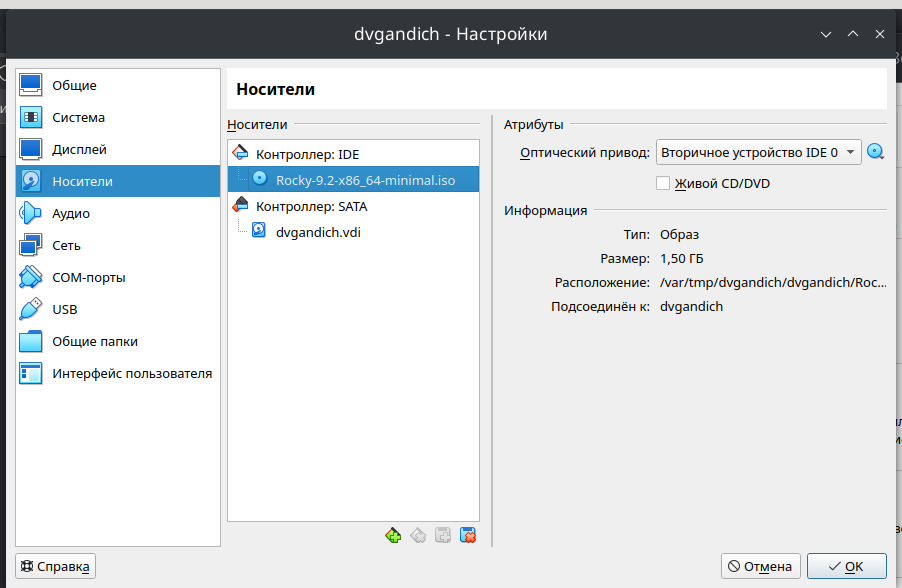
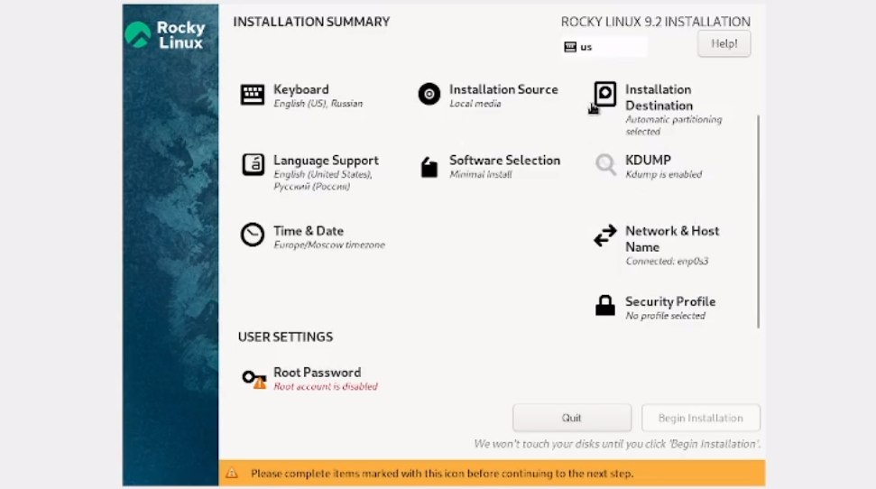
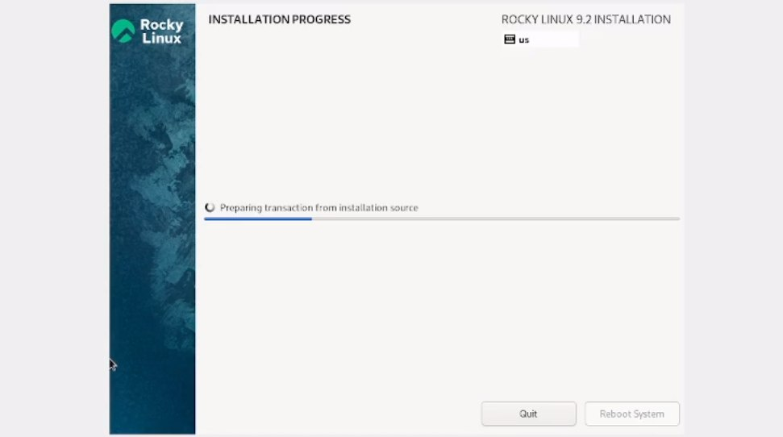
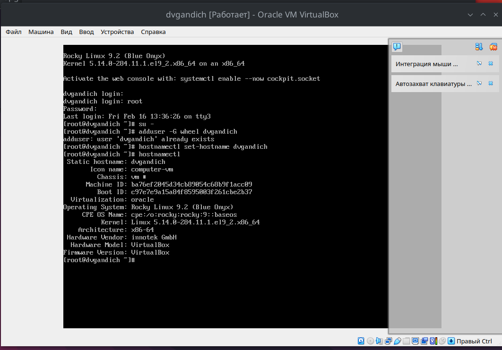
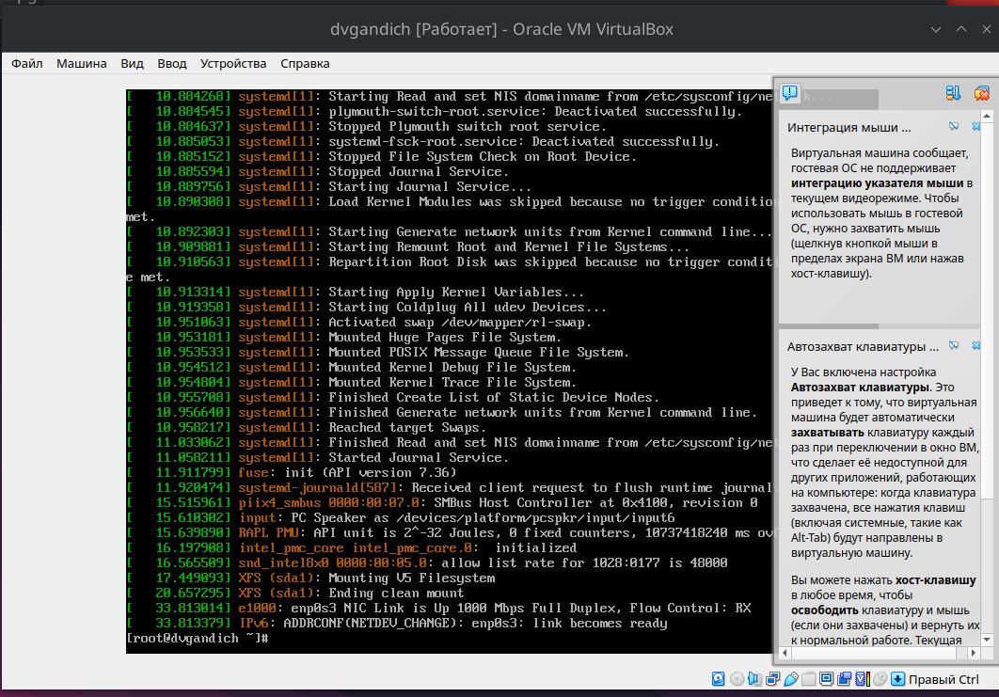
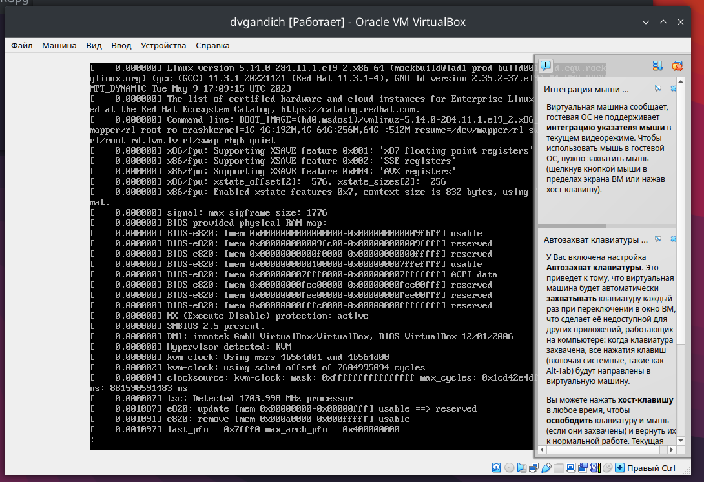
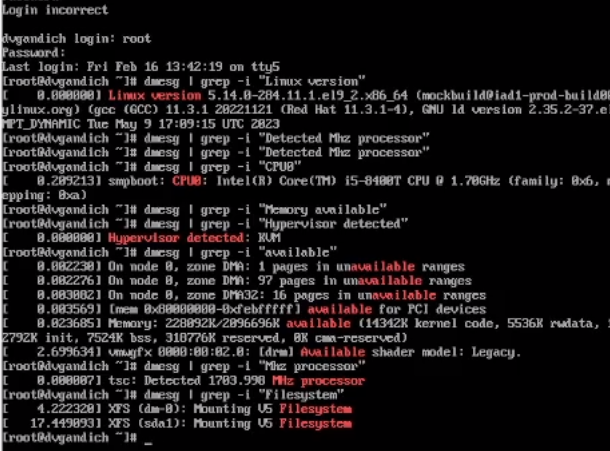

---
## Front matter
lang: ru-RU
title: Лабороторная работа №1
subtitle: Установка и конфигурация операционной системы на виртуальную машину
author:
  - Гандич Дарья Владимировна
institute:
  - Российский университет дружбы народов, Москва, Россия
date: 16 февраля, 2024 г.

## i18n babel
babel-lang: russian
babel-otherlangs: english

## Formatting pdf
toc: false
toc-title: Содержание
slide_level: 2
aspectratio: 169
section-titles: true
theme: metropolis
header-includes:
 - \metroset{progressbar=frametitle,sectionpage=progressbar,numbering=fraction}
 - '\makeatletter'
 - '\beamer@ignorenonframefalse'
 - '\makeatother'
---

# Информация

## Докладчик

:::::::::::::: {.columns align=center}
::: {.column width="70%"}

  * Гандич Дарья Владимировна
  * студентка группы НБИбд-02-22
  * Российский университет дружбы народов
  
:::
::: {.column width="30%"}

:::
::::::::::::::

# Вводная часть

## Цели и задачи

Целью данной работы является приобретение практических навыков установки операционной системы на виртуальную машину, настройки минимально необходимых для дальнейшей работы сервисов.

## Содержание исследования

1. Через консоль открываем Virtual Box

{ #fig:001 width=90% }

##

2. Настраиваем в свойствах VirtualBox месторасположение каталога для виртуальных машин.

{ #fig:002 width=90% }

##

3. Копируем диск с дистрибутивом в папку с именем, оттуда указываем этот диск в носители.

{ #fig:003 width=90% }

##

{ #fig:004 width=90% }

##

4. Запускаем машину, создаем нужные настройки согласно описанию лабораторной работы. 

{ #fig:005 width=90% }

##

5. Ждем установки.

{ #fig:006 width=90% }

##

6. После завершения установки, перезапускаем машину. Входим в систему, совершаем команды из текста лабораторной работы.

{ #fig:007 width=90% }

##

7. Выполняем команду dmesg  и dmesg | less

{ #fig:008 width=90% }

##

{ #fig:009 width=90% }

##

8. Выполняем домашнюю работу, используя команду dmesg | grep -i "то, что ищем"

{ #fig:010 width=90% }

## Результаты

- Мы установили операционную систему Rocky на виртуальную машину. Настроили сервисы для минимальной необходимой работы.

## Итоговый слайд

мы молодцы!
:::
