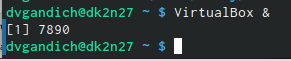
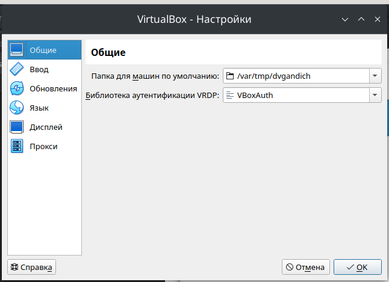
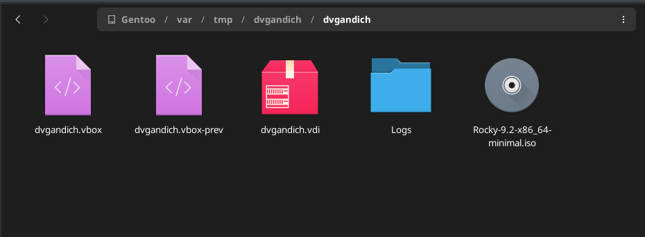
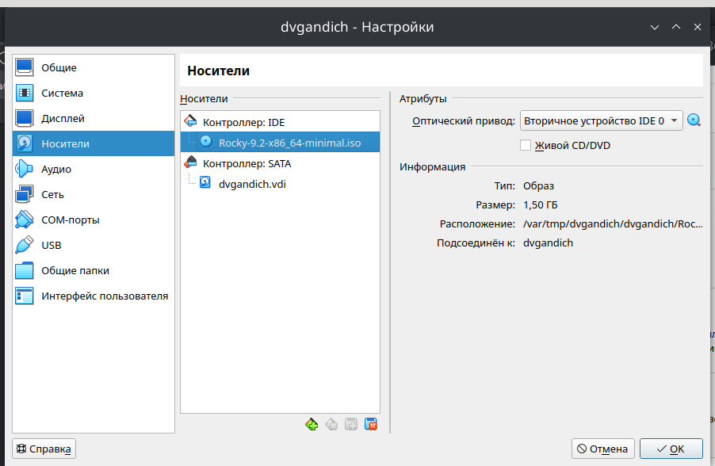
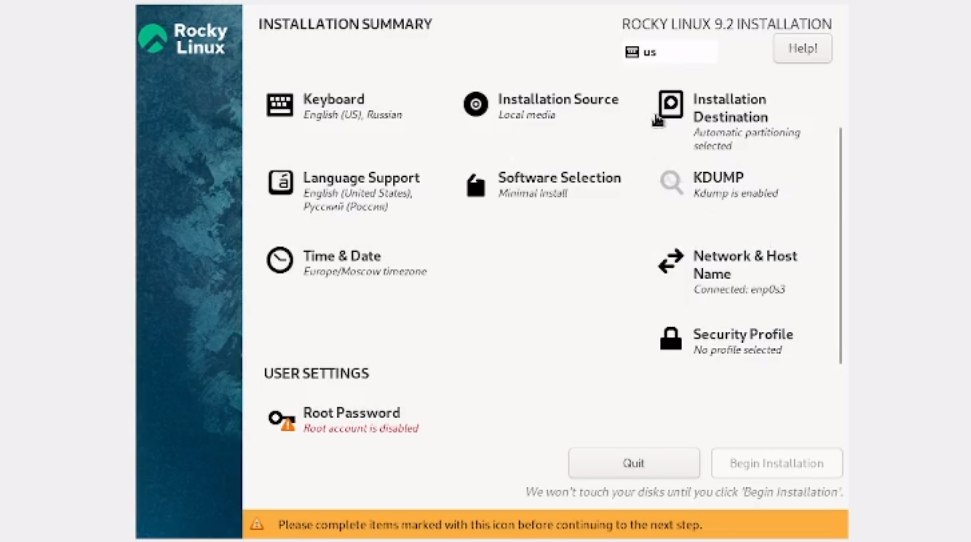
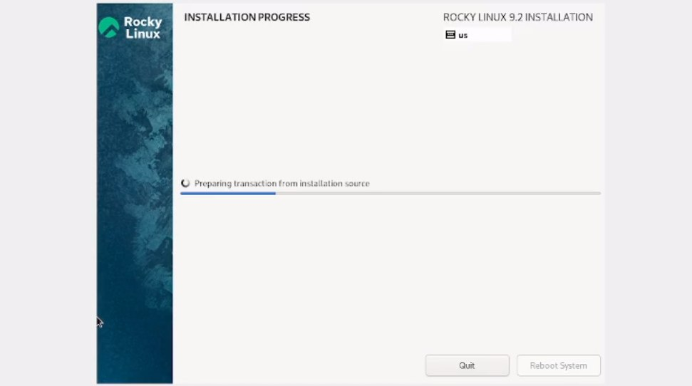
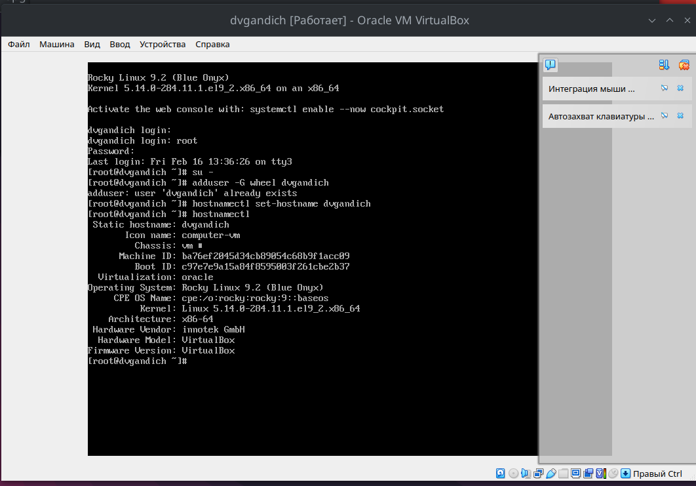
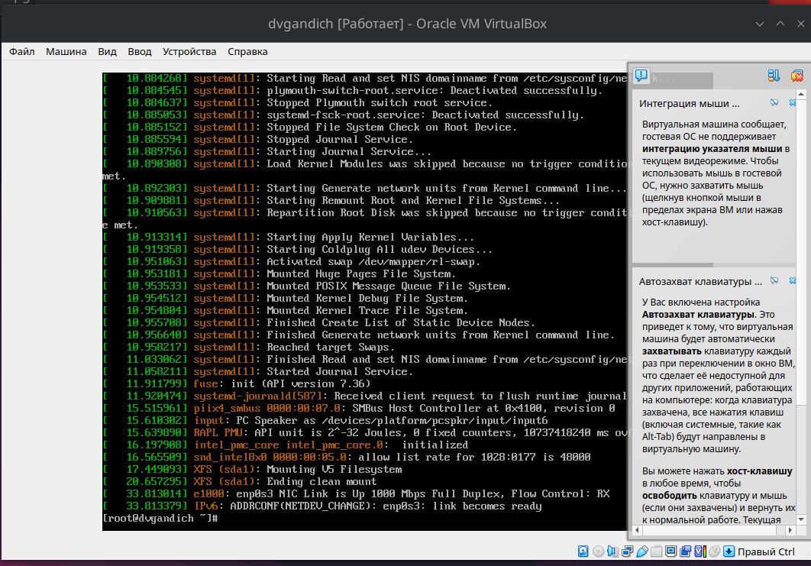
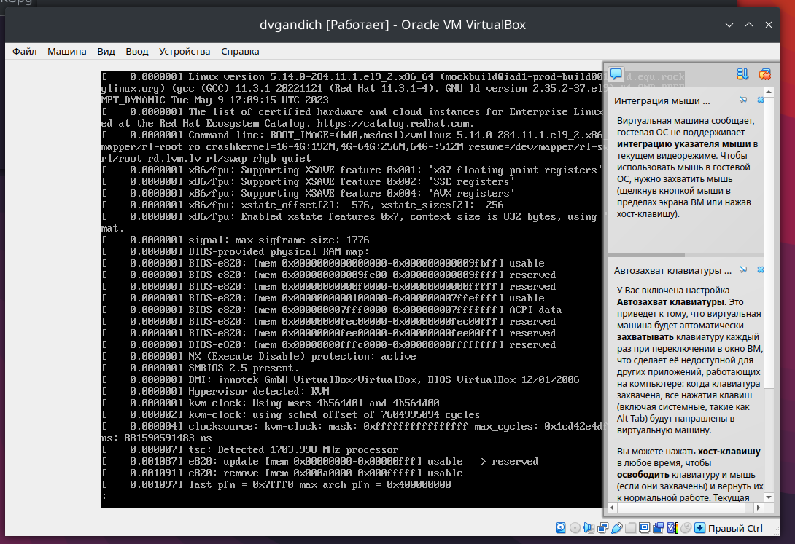

---
## Front matter
title: "Отчёта по лабораторной работе №1."
subtitle: "Установка и конфигурация операционной системы на виртуальную машину"
author: " Гандич Дарья Владимировна. НБИбд-02-22."

## Generic otions
lang: ru-RU
toc-title: "Содержание"

## Bibliography
bibliography: bib/cite.bib
csl: pandoc/csl/gost-r-7-0-5-2008-numeric.csl

## Pdf output format
toc: true # Table of contents
toc-depth: 2
lof: true # List of figures
lot: true # List of tables
fontsize: 12pt
linestretch: 1.5
papersize: a4
documentclass: scrreprt
## I18n polyglossia
polyglossia-lang:
 name: russian
 options:
 - spelling=modern
 - babelshorthands=true
polyglossia-otherlangs:
 name: english
## I18n babel
babel-lang: russian
babel-otherlangs: english
## Fonts
mainfont: PT Serif
romanfont: PT Serif
sansfont: PT Sans
monofont: PT Mono
mainfontoptions: Ligatures=TeX
romanfontoptions: Ligatures=TeX
sansfontoptions: Ligatures=TeX,Scale=MatchLowercase
monofontoptions: Scale=MatchLowercase,Scale=0.9
## Biblatex
biblatex: true
biblio-style: "gost-numeric"
biblatexoptions:
 - parentracker=true
 - backend=biber
 - hyperref=auto
 - language=auto
 - autolang=other*
 - citestyle=gost-numeric
## Pandoc-crossref LaTeX customization
figureTitle: "Рис."
tableTitle: "Таблица"
listingTitle: "Листинг"
lofTitle: "Список иллюстраций"
lolTitle: "Листинги"
## Misc options
indent: true
header-includes:
 - \usepackage{indentfirst}
 - \usepackage{float} # keep figures where there are in the text
 - \floatplacement{figure}{H} # keep figures where there are in the text
---

# Цель работы

Целью данной работы является приобретение практических навыков установки операционной системы на виртуальную машину, настройки минимально необходимых для дальнейшей работы сервисов.

# Выполнение лабораторной работы

1. Создаем файл text.txt и переходим в mc редактор

{ #fig:001 width=90% }

2. Открываем созданный файл в редакторе, вставляем какой-то текст и удаляем одну из строк (выделение - F3) с помощью горячей клавиши Ctrl+y

{ #fig:002 width=90% }

3. Копируем строку с помощью F5

{ #fig:003 width=90% }

4. Перенесем скопированный текст на другую строку с помощью F6

{ #fig:004 width=90% }

5. Перенесемся в конец файла с помощью клавили end и что-то напишем там

{ #fig:005 width=90% }

6. Теперь вернемся в самое начало файла с помощью клавиш ctrl+home и напишем здесь что-нибудь

{ #fig:006 width=90% }

7. Теперь нам нужно выйти и сохранить файл, для этого есть два варианта: просто нажать клавишу F10 для выхода и тогда редактор сам предложит сохранить изменения, или воспользоваться клавишей F2, а уже потом выйти. 

{ #fig:007 width=90% }

{ #fig:008 width=90% }

8. Запускаем любой файл формата .cpp и с помощью клавиши F9 меняем настройки подсветки синтаксиса

{ #fig:009 width=90% }

# Вывод
Мы освоили основные горячие клавиши для работы с редактором mc, применили их в действии

::: {#refs}
:::
