---
## Front matter
lang: ru-RU
title: Лабораторная работа №2
subtitle: Дискреционное разграничение прав в Linux. Основные атрибуты
author:
  - Гандич Д.В.
institute:
  - Российский университет дружбы народов, Москва, Россия
date: 29 февраля 2024

## i18n babel
babel-lang: russian
babel-otherlangs: english

## Formatting pdf
toc: false
toc-title: Содержание
slide_level: 2
aspectratio: 169
section-titles: true
theme: metropolis
header-includes:
 - \metroset{progressbar=frametitle,sectionpage=progressbar,numbering=fraction}
 - '\makeatletter'
 - '\beamer@ignorenonframefalse'
 - '\makeatother'
---

# Информация

## Докладчик

:::::::::::::: {.columns align=center}
::: {.column width="70%"}

  * Гандич Дарья Владимировна
  * студентка группы НБИбд-02-22
  * Российский университет дружбы народов
  
:::
::: {.column width="30%"}

:::
::::::::::::::

## Цели и задачи

Получение практических навыков работы в консоли с атрибутами файлов, закрепление теоретических основ дискреционного разграничения доступа в современных системах с открытым кодом на базе ОС Linux1.

## Содержание исследования

1. Открываем ВМ, создаем учетную запись guest и задаем пароль.

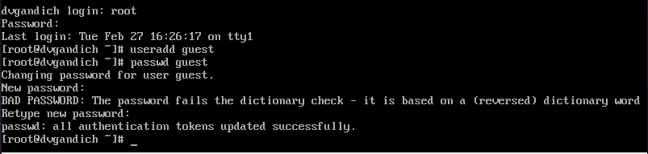{#fig:001 width=70%}

##

2.  Определим директорию, в которой находимся с помощью команды pwd.

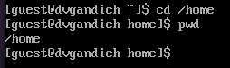{#fig:002 width=70%}

##

3. Уточняем имя пользователя с помощью команды whoami.

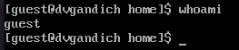{#fig:003 width=70%}

##

4. Уточним имя пользователя, его группу, а также группы, куда входит пользователь, командой id.

Сравнивая вывод id с выводом команды groups, обнаружим, что группы, в которые входит пользователь, действительно одинаковые. Также, сравнивая вывод id c приглашением командной строки, обнаружим, что имя пользователя повторяется.

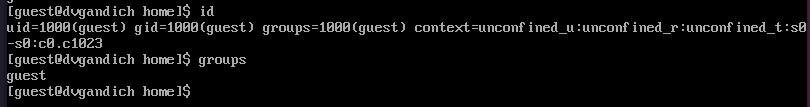{#fig:004 width=70%}

##

5. Просмотрим файл /etc/passwd с помощью cat /etc/passwd и сравним данные uid, gid с результатами команд выше и выясним, что данные значения совпадают.

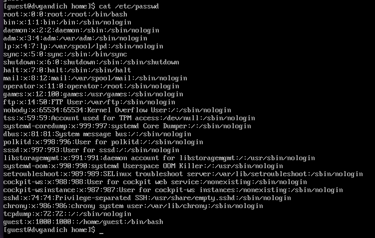{#fig:005 width=70%}

##

6. Определим существующие в системе директории командой ls -l /home/. Нам удалось получить список поддиректорий. У каждой из них установлены права на чтение, запись и выполнение только для самого пользователя.

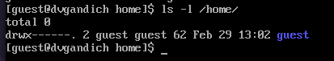{#fig:006 width=70%}

##

7. Проверим, какие расширенные атрибуты установлены на поддиректориях, находящихся в директории /home, командой:
lsattr /home. Нам удалось увидеть расширенные атрибуты директории, но не удалось увидеть расширенные атрибуты директорий других
пользователей.

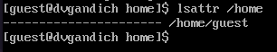{#fig:007 width=70%}

##

8. Создаем в домашней директории поддиректорию dir1. Определяем командами ls -l и lsattr, какие права доступа и расширенные атрибуты были выставлены на директорию dir1.

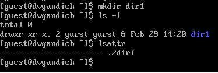{#fig:008 width=70%}

##

9. Снимите с директории dir1 все атрибуты командой chmod 000 dir1 и проверьте с её помощью правильность выполнения команды ls -l.

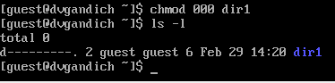{#fig:009 width=70%}

##

10. Попытаемся создать в директории dir1 файл file1 командой echo "test" > /home/guest/dir1/file1 Мы получим отказ от выполнения, так как шагом ранее сняли все атрибуты с директории. Проверим, действительно ли файл не создался, с помощью команды ls -l /home/guest/dir1.

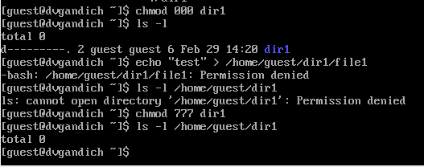{#fig:010 width=70%}

##

11. Заполняем таблицу 2.1 "Установленные права и разрешенные действия".

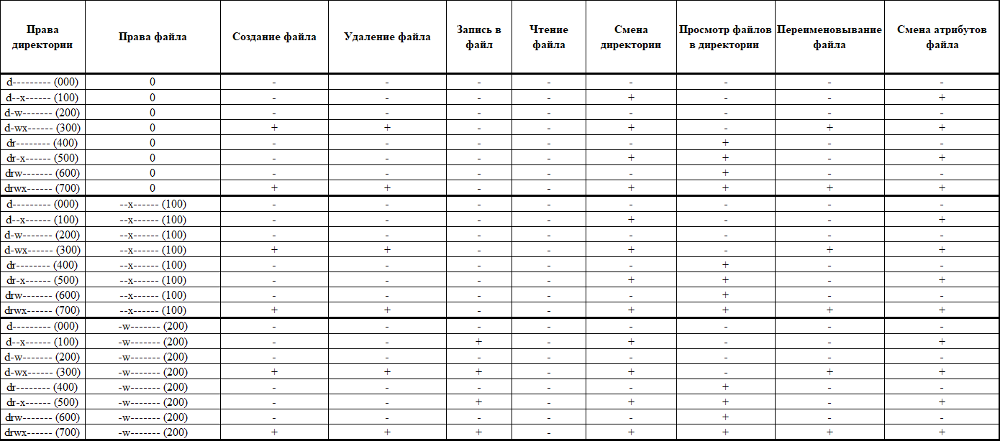{#fig:011 width=70%}

##

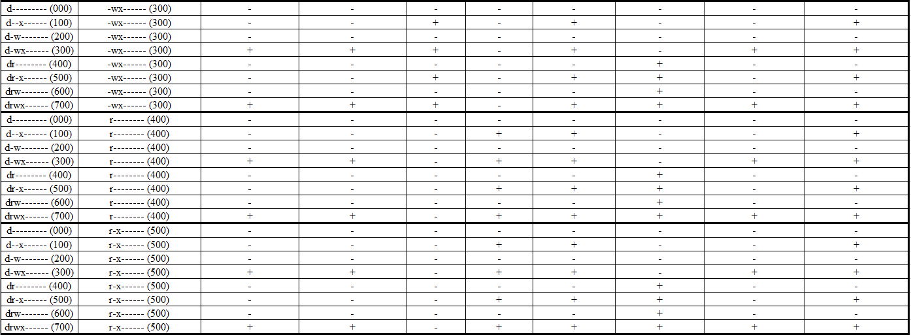{#fig:012 width=70%}

##

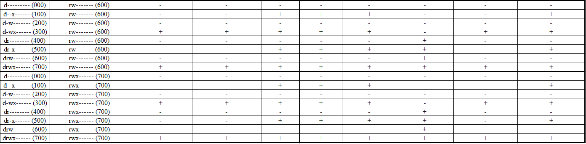{#fig:013 width=70%}

##

12. Заполняем таблицу 2.2 "Минимальные права для совершения операций".

{#fig:014 width=70%}

## Результаты

- Получили практические навыки работы в консоли с атрибутами файлов, закрепили теоретические основы дискреционного разграничения доступа в современных системах с открытым кодом на базе ОС Linux1.

## Итоговый слайд

мы молодцы!
:::
