---
## Front matter
title: "Лабораторная работа №2"
subtitle: "Дискреционное разграничение прав в Linux. Основные атрибуты"
author: "Гандич Дарья Владимировна"

## Generic otions
lang: ru-RU
toc-title: "Содержание"

## Bibliography
bibliography: bib/cite.bib
csl: pandoc/csl/gost-r-7-0-5-2008-numeric.csl

## Pdf output format
toc: true # Table of contents
toc-depth: 2
lof: true # List of figures
lot: true # List of tables
fontsize: 12pt
linestretch: 1.5
papersize: a4
documentclass: scrreprt
## I18n polyglossia
polyglossia-lang:
  name: russian
  options:
	- spelling=modern
	- babelshorthands=true
polyglossia-otherlangs:
  name: english
## I18n babel
babel-lang: russian
babel-otherlangs: english
## Fonts
mainfont: PT Serif
romanfont: PT Serif
sansfont: PT Sans
monofont: PT Mono
mainfontoptions: Ligatures=TeX
romanfontoptions: Ligatures=TeX
sansfontoptions: Ligatures=TeX,Scale=MatchLowercase
monofontoptions: Scale=MatchLowercase,Scale=0.9
## Biblatex
biblatex: true
biblio-style: "gost-numeric"
biblatexoptions:
  - parentracker=true
  - backend=biber
  - hyperref=auto
  - language=auto
  - autolang=other*
  - citestyle=gost-numeric
## Pandoc-crossref LaTeX customization
figureTitle: "Рис."
tableTitle: "Таблица"
listingTitle: "Листинг"
lofTitle: "Список иллюстраций"
lotTitle: "Список таблиц"
lolTitle: "Листинги"
## Misc options
indent: true
header-includes:
  - \usepackage{indentfirst}
  - \usepackage{float} # keep figures where there are in the text
  - \floatplacement{figure}{H} # keep figures where there are in the text
---

# Цель работы

Получение практических навыков работы в консоли с атрибутами файлов, закрепление теоретических основ дискреционного разграничения доступа в современных системах с открытым кодом на базе ОС Linux1.

# Теоретическое введение                                              |

Более подробно про Unix см. в [@tanenbaum_book_modern-os_ru; @robbins_book_bash_en; @zarrelli_book_mastering-bash_en; @newham_book_learning-bash_en].

# Выполнение лабораторной работы

1. Открываем ВМ, создаем учетную запись guest и задаем пароль (рис. [-@fig:001]).

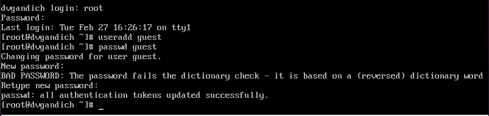{#fig:001 width=70%}

2.  Определим директорию, в которой находимся с помощью команды pwd (рис. [-@fig:002]).

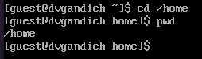{#fig:002 width=70%}

3. Уточняем имя пользователя с помощью команды whoami (рис. [-@fig:003]).

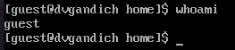{#fig:003 width=70%}

4. Уточним имя пользователя, его группу, а также группы, куда входит пользователь, командой id.

Сравнивая вывод id с выводом команды groups, обнаружим, что группы, в которые входит пользователь, действительно одинаковые. Также, сравнивая вывод id c приглашением командной строки, обнаружим, что имя пользователя повторяется. (рис. [-@fig:004]).

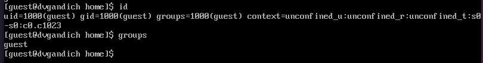{#fig:004 width=70%}

5. Просмотрим файл /etc/passwd с помощью cat /etc/passwd и сравним данные uid, gid с результатами команд выше и выясним, что данные значения совпадают. (рис. [-@fig:005]).

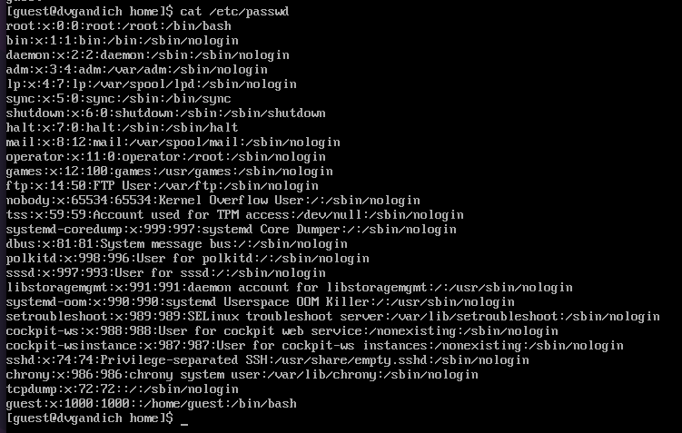{#fig:005 width=70%}

6. Определим существующие в системе директории командой ls -l /home/. Нам удалось получить список поддиректорий. У каждой из них установлены права на чтение, запись и выполнение только для самого пользователя. (рис. [-@fig:006]).

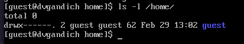{#fig:006 width=70%}

7. Проверим, какие расширенные атрибуты установлены на поддиректориях, находящихся в директории /home, командой:
lsattr /home. Нам удалось увидеть расширенные атрибуты директории, но не удалось увидеть расширенные атрибуты директорий других
пользователей.(рис. [-@fig:007]).

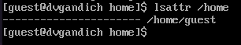{#fig:007 width=70%}

8. Создаем в домашней директории поддиректорию dir1. Определяем командами ls -l и lsattr, какие права доступа и расширенные атрибуты были выставлены на директорию dir1. (рис. [-@fig:008]).

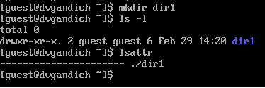{#fig:008 width=70%}

9. Снимите с директории dir1 все атрибуты командой chmod 000 dir1 и проверьте с её помощью правильность выполнения команды ls -l (рис. [-@fig:009]).

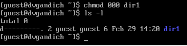{#fig:009 width=70%}

10. Попытаемся создать в директории dir1 файл file1 командой echo "test" > /home/guest/dir1/file1 Мы получим отказ от выполнения, так как шагом ранее сняли все атрибуты с директории. Проверим, действительно ли файл не создался, с помощью команды ls -l /home/guest/dir1. (рис. [-@fig:010]).

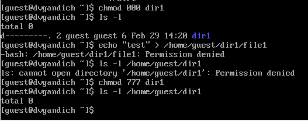{#fig:010 width=70%}

11. Заполняем таблицу 2.1 "Установленные права и разрешенные действия"  (рис. [-@fig:011]), (рис. [-@fig:012]), (рис. [-@fig:013])

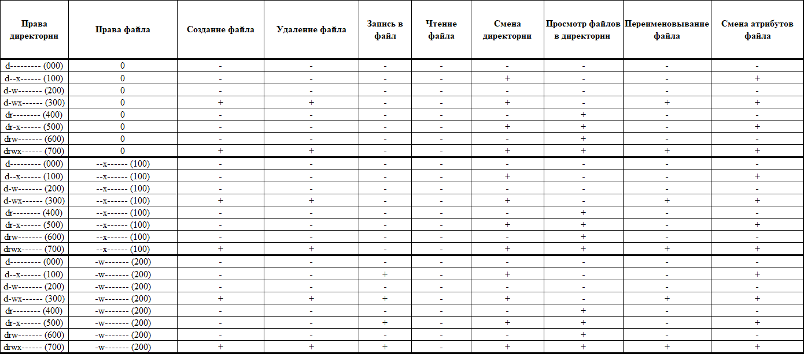{#fig:011 width=70%}

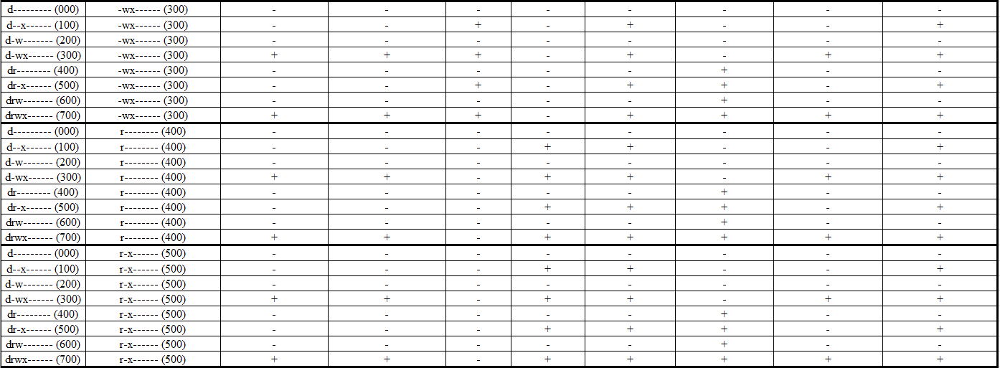{#fig:012 width=70%}

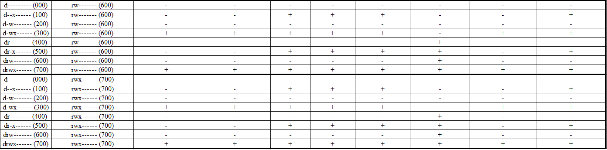{#fig:013 width=70%}

12. Заполняем таблицу 2.2 "Минимальные права для совершения операций" (рис. [-@fig:014])

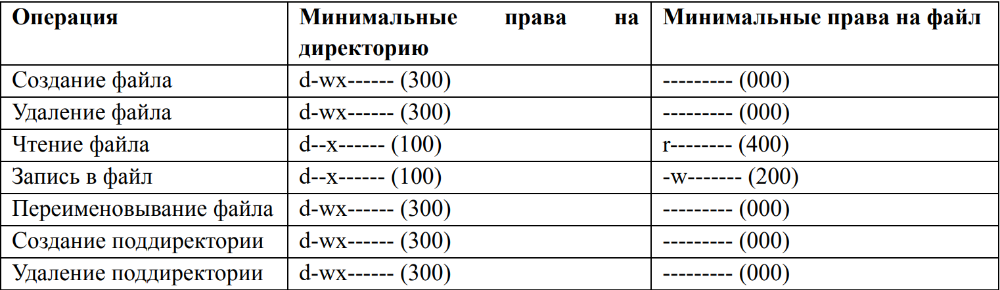{#fig:014 width=70%}

# Выводы

Получили практические навыки работы в консоли с атрибутами файлов, закрепили теоретические основы дискреционного разграничения доступа в современных системах с открытым кодом на базе ОС Linux1.

# Список литературы{.unnumbered}

::: {#refs}
:::
