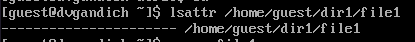
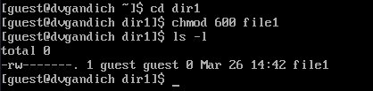
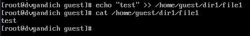
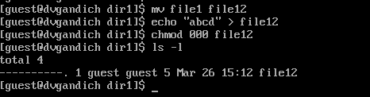

---
## Front matter
lang: ru-RU
title: Лабораторная работа № 2
subtitle: Основы информационной безопасности
author:
  - Зарифбеков А.П.
institute:
  - Российский университет дружбы народов, Москва, Россия
date: 29 февраля 2024

## i18n babel
babel-lang: russian
babel-otherlangs: english

## Formatting pdf
toc: false
toc-title: Содержание
slide_level: 2
aspectratio: 169
section-titles: true
theme: metropolis
header-includes:
 - \metroset{progressbar=frametitle,sectionpage=progressbar,numbering=fraction}
 - '\makeatletter'
 - '\beamer@ignorenonframefalse'
 - '\makeatother'
---

## Актуальность

- Получение практических навыков
- закрепление теоретических основ

## Цели и задачи

- Получение практических навыков работы в консоли с атрибутами файлов, закрепление теоретических основ дискреционного разграничения доступа в современных системах с открытым кодом на базе ОС Linux1

## Содержание исследования

1. в установленной на предедушей паре операционной системе сохдадим учётную запись guest. Зададим пароль для пользователя guest

{#fig 001 width=70%}

##

2. Зайдём в систему от имени guest. определим директорию, в которой мы находимся, командой pwdю сравним её с приглашением командной строки. определим, является ли она нашей домашней директорей . уточним имя пользователя командой whoami.

{#fig:002 width=70%}

##

3. Уточним имя нашего пользователя , его группу, а также группы, куда входит пользователь , командой id. 

{#fig:6 width=70%}

##

4.  Просмотрим  файл /etc/passwd командойcat /etc/passwd Найдём  в нём свою учётную запись. Определим  uid пользователя. Определим gid пользователя. Сравним найденные значения с полученными в предыдущих пунктах.

{#fig:8 width=70%}

##

5. Определим  существующие в системе директории командойls -l /home/

{#fig:009 width=70%}

##

6. Проверим , какие расширенные атрибуты установлены на поддиректориях, находящихся в директории /home, командой:lsattr /home. Создадим в домашней директории поддиректорию dir1 командой mkdir dir1

{#fig:010 width=70%}

##

7. Снимим  с директории dir1 все атрибуты командой chmod 000 dir1 и проверим с её помощью правильность выполнения команды ls -l. Попытаемся  создать в директории dir1 файл file1 командой
echo "test" > /home/guest/dir1/file1

{#fig:012 width=70%}

##

8. Заполним  таблицу «Установленные права и разрешённые действия», выполняя действия от имени владельца директории (фай-лов), определив опытным путём, какие операции разрешены, а какие нет.
Если операция разрешена, занесём в таблицу знак «+», если не разрешена, знак «-».

{#fig:014 width=70%} 

##

{#fig:015 width=70%} 

##

{#fig:016 width=70%} 

##

9. На основании заполненной таблицы определим те или иные минимально необходимые права для выполнения операций внутри директории dir1

{#fig:017 width=70%} 
 
# Выводы

Получили практические навыки работы в консоли с атрибутами файлов, закрепили теоретические основы дискреционного разграничения доступа в современных системах с открытым кодом на базе ОС Linux1
 

