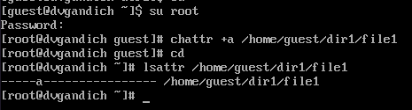

---
## Front matter
title: "Лабораторная работа №4"
subtitle: "Дискреционное разграничение прав в Linux. Расширенные атрибуты"
author: "Гандич Дарья Владимировна"

## Generic otions
lang: ru-RU
toc-title: "Содержание"

## Bibliography
bibliography: bib/cite.bib
csl: pandoc/csl/gost-r-7-0-5-2008-numeric.csl

## Pdf output format
toc: true # Table of contents
toc-depth: 2
lof: true # List of figures
lot: true # List of tables
fontsize: 12pt
linestretch: 1.5
papersize: a4
documentclass: scrreprt
## I18n polyglossia
polyglossia-lang:
  name: russian
  options:
	- spelling=modern
	- babelshorthands=true
polyglossia-otherlangs:
  name: english
## I18n babel
babel-lang: russian
babel-otherlangs: english
## Fonts
mainfont: PT Serif
romanfont: PT Serif
sansfont: PT Sans
monofont: PT Mono
mainfontoptions: Ligatures=TeX
romanfontoptions: Ligatures=TeX
sansfontoptions: Ligatures=TeX,Scale=MatchLowercase
monofontoptions: Scale=MatchLowercase,Scale=0.9
## Biblatex
biblatex: true
biblio-style: "gost-numeric"
biblatexoptions:
  - parentracker=true
  - backend=biber
  - hyperref=auto
  - language=auto
  - autolang=other*
  - citestyle=gost-numeric
## Pandoc-crossref LaTeX customization
figureTitle: "Рис."
tableTitle: "Таблица"
listingTitle: "Листинг"
lofTitle: "Список иллюстраций"
lotTitle: "Список таблиц"
lolTitle: "Листинги"
## Misc options
indent: true
header-includes:
  - \usepackage{indentfirst}
  - \usepackage{float} # keep figures where there are in the text
  - \floatplacement{figure}{H} # keep figures where there are in the text
---

# Цель работы

Получение практических навыков работы в консоли с расширенными атрибутами файлов

# Теоретическое введение                                              |

Более подробно про Unix см. в [@tanenbaum_book_modern-os_ru; @robbins_book_bash_en; @zarrelli_book_mastering-bash_en; @newham_book_learning-bash_en].

# Выполнение лабораторной работы

1. От имени пользователя guest определите расширенные атрибуты файла /home/guest/dir1/file1 командой lsattr /home/guest/dir1/file1 (рис. [-@fig:001]).

{#fig:001 width=70%}

2. Установим командой chmod 600 file1 на файл file1 права, разрешающие чтение и запись для владельца файла. (рис. [-@fig:002]).

{#fig:002 width=70%}

3. Попробуем установить на файл /home/guest/dir1/file1 расширенный атрибут a от имени пользователя guest (рис. [-@fig:003]). В ответ получим отказ.

{#fig:003 width=70%}

4. Зайдем на третью консоль с правами администратора с помощью команды su. Попробуем установить расширенный атрибут a на файл /home/guest/dir1/file1 от имени суперпользователя.  (рис. [-@fig:004]).

{#fig:004 width=70%}

5. От пользователя guest проверяем правильность установления атрибута (рис. [-@fig:005]).

{#fig:005 width=70%}

6. Выполняем дозапись в файл file1 слова «test». После этого выполняем чтение файла file1 командой cat /home/guest/dir1/file1 (рис. [-@fig:006]).

{#fig:006 width=70%}

7. Попробуем удалить файл file1 командой echo "abcd" > /home/guest/dirl/file1. Попробуем переименовать файл. Получили отказ в обоих случаях. (рис. [-@fig:007])

{#fig:007 width=70%}

8. Попробуем с помощью команды chmod 000 file1 установить на файл file1 права, например, запрещающие чтение и запись для владельца файла. Команду выполнить не удалось (рис. [-@fig:008]).

{#fig:008 width=70%}

9. Снимите расширенный атрибут a с файла /home/guest/dirl/file1 от имени суперпользователя (рис. [-@fig:009]).

{#fig:009 width=70%}

10. Повторим операции, которые нам ранее не удавалось выполнить. Теперь все команды работают (рис. [-@fig:010]).

{#fig:010 width=70%}

# Выводы

В результате выполнения работы мы повысили свои навыки использования интерфейса командой строки (CLI), познакомились на примерах с тем, как используются основные и расширенные атрибуты при разграничении доступа. Имели возможность связать теорию дискреционного разделения доступа (дискреционная политика безопасности) с её реализацией на практике в ОС Linux. Составили наглядные таблицы, поясняющие какие операции возможны при тех или иных установленных правах. Опробовали действие на практике расширенных атрибутов «а».

# Список литературы{.unnumbered}

::: {#refs}
:::
