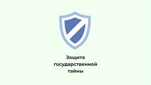

---
## Front matter
lang: ru-RU
title: Лабораторная работа № 3
subtitle: Основы информационной безопасности
author:
  - Зарифбеков А.П.
institute:
  - Российский университет дружбы народов, Москва, Россия
date: 29 февраля 2024

## i18n babel
babel-lang: russian
babel-otherlangs: english

## Formatting pdf
toc: false
toc-title: Содержание
slide_level: 2
aspectratio: 169
section-titles: true
theme: metropolis
header-includes:
 - \metroset{progressbar=frametitle,sectionpage=progressbar,numbering=fraction}
 - '\makeatletter'
 - '\beamer@ignorenonframefalse'
 - '\makeatother'
---

## Актуальность

- Получение практических навыков
- закрепление теоретических основ

## Цели и задачи

- Получение практических навыков работы в консоли с атрибутами файлов для групп пользователей

## Содержание исследования

1. в установленной на предедушей паре операционной системе  создадаим учётную запись guest. Зададим пароль для пользователя guest

{#fig 001 width=70%}

##

2. тоже самое мы делаем для guest2, и так же задаём пароль для guest2

{#fig:002 width=70%}

##

3. Добавим пользователя guest2 в группу guest

{#fig:003 width=70%}

##

4.  Осуществляю  вход в систему от имени guest. Для  guest  командой pwd опредлю директорию, в кото-
рой мы  находимся. Сравним её с приглашениями командной строки. Уточним имя своего пользователя, его группу, кто входит в неё и к каким группам принадлежит он сам. Определяю  командами
groups guest , в какие группы входит пользователь guest Сравните вывод команды groups с выводом команд id -Gn и id -G. Сравниваю  полученную информацию с содержимым файла /etc/group.
Просмотрите файл командой cat /etc/group

{#fig:004 width=70%}

##

5. Осуществляю  вход в систему от имени guest. Для  guest2  командой pwd опредлю директорию, в кото-
рой мы  находимся. Сравним её с приглашениями командной строки. Уточним имя своего пользователя, его группу, кто входит в неё и к каким группам принадлежит он сам. Определяю  командами
groups guest2, в какие группы входит пользователь guest2 Сравните вывод команды groups с выводом команд id -Gn и id -G. Сравниваю  полученную информацию с содержимым файла /etc/group.
Просмотрите файл командой cat /etc/group 

{#fig:005 width=70%}

##

6. От имени пользователя guest2 выполняю регистрацию пользователя guest2 в группе guest командой 

{#fig:006 width=70%}

##

7. От имени пользователя guest изменяю права директории /home/guest,разрешив все действия для пользователей групы. От имени пользователя guest снимаю  с директории /home/guest/dir1
все атрибуты командой chmod 000 dir

{#fig:007 width=70%}

##

8. Меняю атрибуты у директории dir1 и файла file1 от имени пользователя guest и делая проверку от пользователя guest2, заполняю табл. 3.1,определив опытным путём, какие операции разрешены, а какие нет.Заношу в таблицу знак «+», если не разрешена,
знак «-».Сравниваю табл. 2.1 (из лабораторной работы № 2) и табл. 3.1.На основании заполненной таблицы определяю  те или иные минимально необходимые права для выполнения пользователем guest2 операцийвнутри директории dir1 и заполните табл. 3.2.

{#fig:008 width=70%} 

##

{#fig:009 width=70%} 

##

{#fig:010 width=70%} 

##

{#fig:011 width=70%} 

##

{#fig:012 width=70%} 

##

{#fig:013 width=70%} 

# Выводы

Получил практические навыки работы в консоли с атрибутами файлов для групп пользователей
 
Получил практические навыки работы в консоли с атрибутами файлов для групп пользователей

