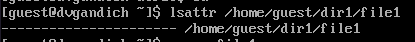
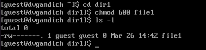
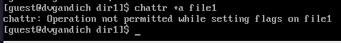
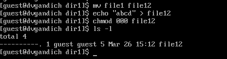

---
## Front matter
lang: ru-RU
title: Лабораторная работа №4
subtitle: Дискреционное разграничение прав в Linux. Расширенные атрибуты
author:
  - Гандич Д.В.
institute:
  - Российский университет дружбы народов, Москва, Россия
date: 26 марта 2024

## i18n babel
babel-lang: russian
babel-otherlangs: english

## Formatting pdf
toc: false
toc-title: Содержание
slide_level: 2
aspectratio: 169
section-titles: true
theme: metropolis
header-includes:
 - \metroset{progressbar=frametitle,sectionpage=progressbar,numbering=fraction}
 - '\makeatletter'
 - '\beamer@ignorenonframefalse'
 - '\makeatother'
---

# Информация

## Докладчик

:::::::::::::: {.columns align=center}
::: {.column width="70%"}

  * Гандич Дарья Владимировна
  * студентка группы НБИбд-02-22
  * Российский университет дружбы народов
  
:::
::: {.column width="30%"}

:::
::::::::::::::

## Цели и задачи

Получение практических навыков работы в консоли с расширенными атрибутами файлов

## Содержание исследования

1. От имени пользователя guest определите расширенные атрибуты файла /home/guest/dir1/file1 командой lsattr /home/guest/dir1/file1.

{#fig:001 width=70%}

##

2. Установим командой chmod 600 file1 на файл file1 права, разрешающие чтение и запись для владельца файла.

{#fig:002 width=70%}

##

3. Попробуем установить на файл /home/guest/dir1/file1 расширенный атрибут a от имени пользователя guest. В ответ получим отказ.

{#fig:003 width=70%}

##

4. Зайдем на третью консоль с правами администратора с помощью команды su. Попробуем установить расширенный атрибут a на файл /home/guest/dir1/file1 от имени суперпользователя.

{#fig:004 width=70%}

##

5. От пользователя guest проверяем правильность установления атрибута.

{#fig:005 width=70%}

##

6. Выполняем дозапись в файл file1 слова «test». После этого выполняем чтение файла file1 командой cat /home/guest/dir1/file1

{#fig:006 width=70%}

##

7. Попробуем удалить файл file1 командой echo "abcd" > /home/guest/dirl/file1. Попробуем переименовать файл. Получили отказ в обоих случаях.

{#fig:007 width=70%}

##

8. Попробуем с помощью команды chmod 000 file1 установить на файл file1 права, например, запрещающие чтение и запись для владельца файла. Команду выполнить не удалось.

{#fig:008 width=70%}

##

9. Снимите расширенный атрибут a с файла /home/guest/dirl/file1 от имени суперпользователя.

{#fig:009 width=70%}

##

10. Повторим операции, которые нам ранее не удавалось выполнить. Теперь все команды работают.

{#fig:010 width=70%}

## Результаты

- В результате выполнения работы мы повысили свои навыки использования интерфейса командой строки (CLI), познакомились на примерах с тем, как используются основные и расширенные атрибуты при разграничении доступа. Имели возможность связать теорию дискреционного разделения доступа (дискреционная политика безопасности) с её реализацией на практике в ОС Linux. Составили наглядные таблицы, поясняющие какие операции возможны при тех или иных установленных правах. Опробовали действие на практике расширенных атрибутов «а».

## Итоговый слайд

мы молодцы!
:::
