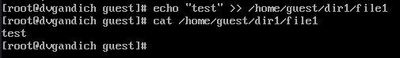
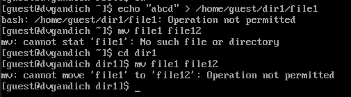

---
## Front matter
lang: ru-RU
title: Лабораторная работа №4
subtitle: Дискреционное разграничение прав в Linux. Расширенные атрибуты
author:
  - Ежова А. М.
institute:
  - Российский университет дружбы народов, Москва, Россия
  - Факультет физико-математических и естественных наук
date: 26 марта 2024

## i18n babel
babel-lang: russian
babel-otherlangs: english

## Formatting pdf
toc: false
toc-title: Содержание
slide_level: 2
aspectratio: 169
section-titles: true
theme: metropolis
header-includes:
 - \metroset{progressbar=frametitle,sectionpage=progressbar,numbering=fraction}
 - '\makeatletter'
 - '\beamer@ignorenonframefalse'
 - '\makeatother'
---

# Информация

## Докладчик

:::::::::::::: {.columns align=center}
::: {.column width="70%"}

  * Ежова Алиса Михайловна
  * студентка НБИбд-01-22
  * Российский университет дружбы народов
  * <https://github.com/AlisaEzhova>

:::
::: {.column width="30%"}


:::
::::::::::::::

# Вводная часть

## Актуальность

Данная лабораторная работа актуальна для студентов, кто хочет приобрести практические навыки взаимодействия пользователся с виртуальной машиной.

## Материалы и методы

- Процессор `pandoc` для входного формата Markdown
- Результирующие форматы
	- `pdf`
	- `html`
- Автоматизация процесса создания: `Makefile`

# Создание презентации

## Процессор `pandoc`

- Pandoc: преобразователь текстовых файлов
- Сайт: <https://pandoc.org/>
- Репозиторий: <https://github.com/jgm/pandoc>

## Формат `pdf`

- Использование LaTeX
- Пакет для презентации: [beamer](https://ctan.org/pkg/beamer)
- Тема оформления: `metropolis`

## Код для формата `pdf`

```yaml
slide_level: 2
aspectratio: 169
section-titles: true
theme: metropolis
```

## Формат `html`

- Используется фреймворк [reveal.js](https://revealjs.com/)
- Используется [тема](https://revealjs.com/themes/) `beige`

## Код для формата `html`

- Тема задаётся в файле `Makefile`

```make
REVEALJS_THEME = beige 
```

## Содержание исследования

1) От имени пользователя guest определила расширенные атрибуты файла /home/guest/dir1/file1 командой
lsattr /home/guest/dir1/file1:

{#fig:001 width=90%}

##

2) Установила командой chmod 600 file1 на файл file1 права, разрешающие чтение и запись для владельца файла:

{#fig:002 width=90%}

##

3) Попробовала установить на файл /home/guest/dir1/file1 расширенный атрибут a от имени пользователя guest: chattr +a /home/guest/dir1/file1
В ответ я получила отказ от выполнения операции:

{#fig:003 width=90%}

##

4) Повысив свои права с помощью команды su. Попробовала установить расширенный атрибут a на файл /home/guest/dir1/file1 от имени суперпользователя: chattr +a /home/guest/dir1/file1:

{#fig:004 width=90%}

##

5) От пользователя guest проверила правильность установления атрибута: lsattr /home/guest/dir1/file1: 

{#fig:005 width=90%}

##

6) Выполнила дозапись в файл file1 слова «test» командой echo "test" /home/guest/dir1/file1
После этого выполнила чтение файла file1 командой cat /home/guest/dir1/file1
Убедилась, что слово test было успешно записано в file1:

{#fig:006 width=90%}

##

7) Попробовала удалить файл file1 либо стереть имеющуюся в нём информацию командой echo "abcd" > /home/guest/dirl/file1. И мне вышла ошибка:

{#fig:007 width=90%}

##

8) Сняла расширенный атрибут a с файла /home/guest/dirl/file1 от имени суперпользователя командой
chattr -a /home/guest/dir1/file1. И у меня все получилось:

{#fig:008 width=90%}

## Итоговый слайд

В ходе выполнения лабораторной работы №4, я повысила свои навыки использования интерфейса командой строки (CLI), познакомилась на примерах с тем, как используются основные и расширенные атрибуты при разграничении доступа. Имела возможность связать теорию дискреционного разделения доступа (дискреционная политика безопасности) с её реализацией на практике в ОС Linux. Составила наглядные таблицы, поясняющие какие операции возможны при тех или иных установленных правах. Опробовали действие на практике расширенных атрибутов «а» и «i».
